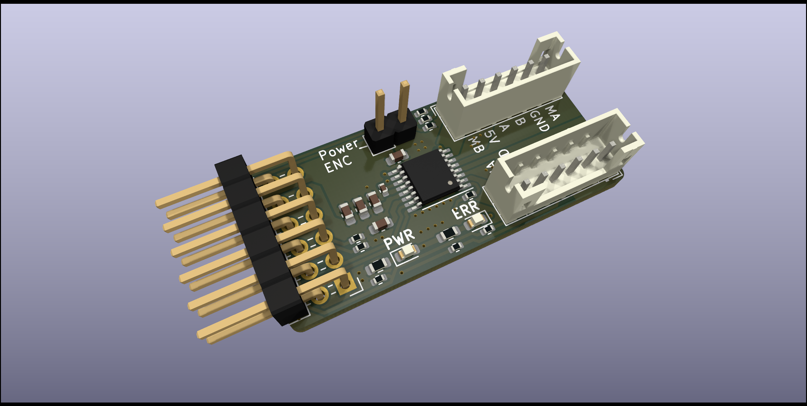
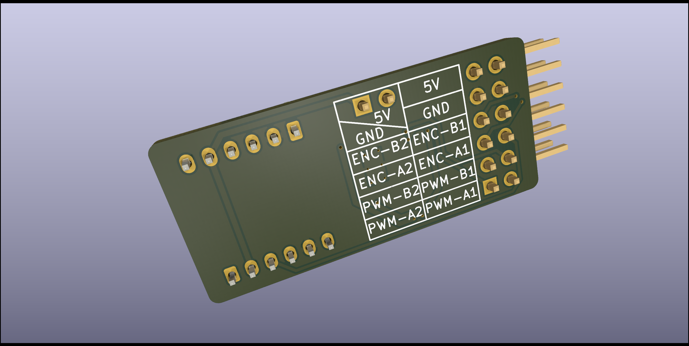

# Pmod_DC-motor-driver
Simple DC motor driver with Pmod connector for use with, for example, ELKS boards ([**ESP Learning Kit Starter**](https://github.com/RoboticsBrno/RB3206-ELKS)) or [**Logic v2**](https://github.com/RoboticsBrno/RB3205-Logic/tree/main).
This boart us [DRV8833](https://www.ti.com/lit/ds/symlink/drv8833.pdf?ts=1706616937503&ref_url=https%253A%252F%252Fwww.google.com%252F) motor driver that can drive two DC motors with a maximum continuous current of 1.5 A.

The power ENC jumper serves as an option to disconnect the 5V power supply from the motor connector for ENCs that are not 5V tolerant. In normal mode you need to connect a jumper.